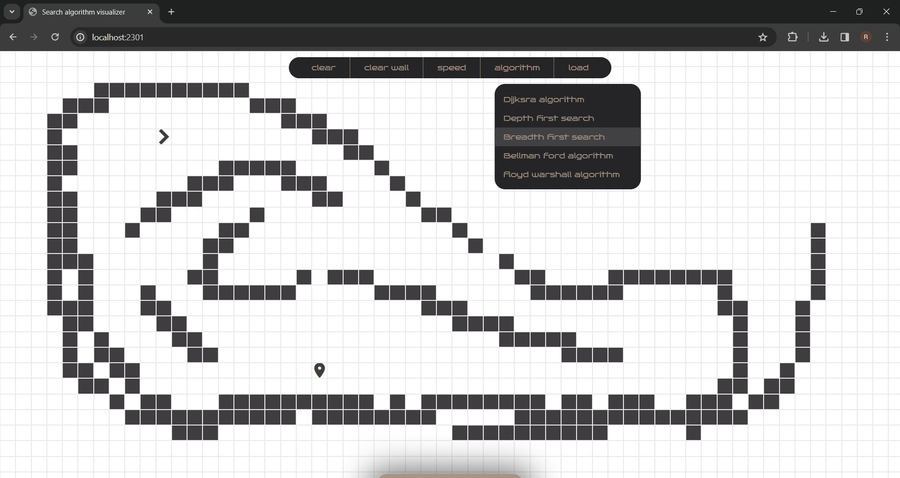
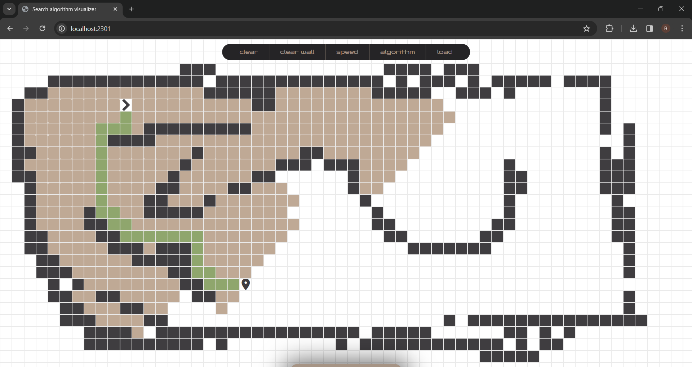

# Search Algorithm Visualizer

A web-based tool to visualize popular search algorithms such as Breadth-First Search (BFS), Depth-First Search (DFS), and more. This interactive application helps users understand how these algorithms explore a grid to find the shortest path between two points.

## Live on [https://search-algorithm-visulazier-4362119788.asia-south1.run.app/](https://search-algorithm-visulazier-4362119788.asia-south1.run.app/)

## Features

- Visualizes **Breadth-First Search (BFS)** and **Depth-First Search (DFS)**
- Interactive grid: set start and end points, and add walls
- Animated search path and final shortest path
- Clear and reset functionality

##  Algorithms Implemented

- **Breadth-First Search (BFS)**: Explores all neighbors at the current depth before going deeper.
- **Depth-First Search (DFS)**: Explores as far as possible along one branch before backtracking.

## 🛠 Technologies Used

- HTML5
- CSS3
- JavaScript (Vanilla)


## 🖼️ Screenshots




##  Installation

1. Clone the repository:

```bash
git clone https://github.com/Rajnish8292/search_algorithm_visulazier.git
cd search_algorithm_visulazier

```


2. Install Dependencies
```bash
npm install
```

3. Run the server
```bash
npm run start
#or
node server.js
#or
nodemon server.js
```

Open http://localhost:2301 to view the web app in your browser

## How to Use
1.  Set the start and end point by draging start and end icon on the grid.
2.  while mouse is clicked move mouse over the grid to draw the walls.
3.  click on visualize button on bottom of the page.


## Author
Made by Rajnish Raj
### Connect on [LinkedIn](https://www.linkedin.com/in/rajnish-raj-9139602a4/)

